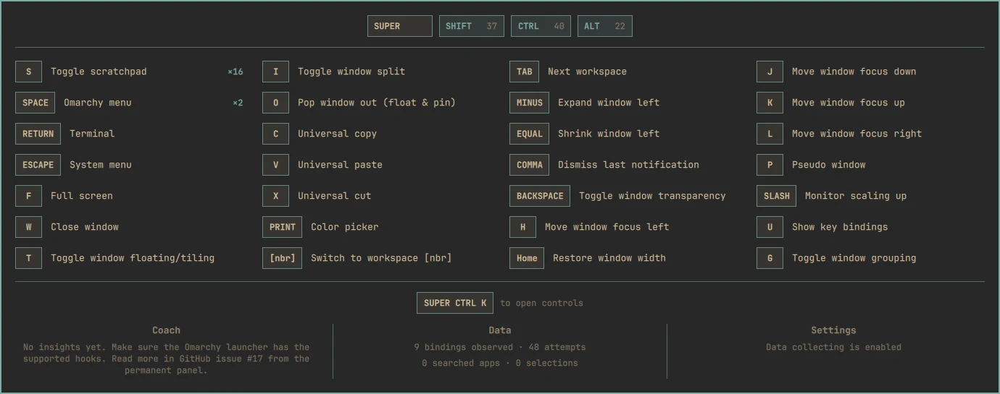
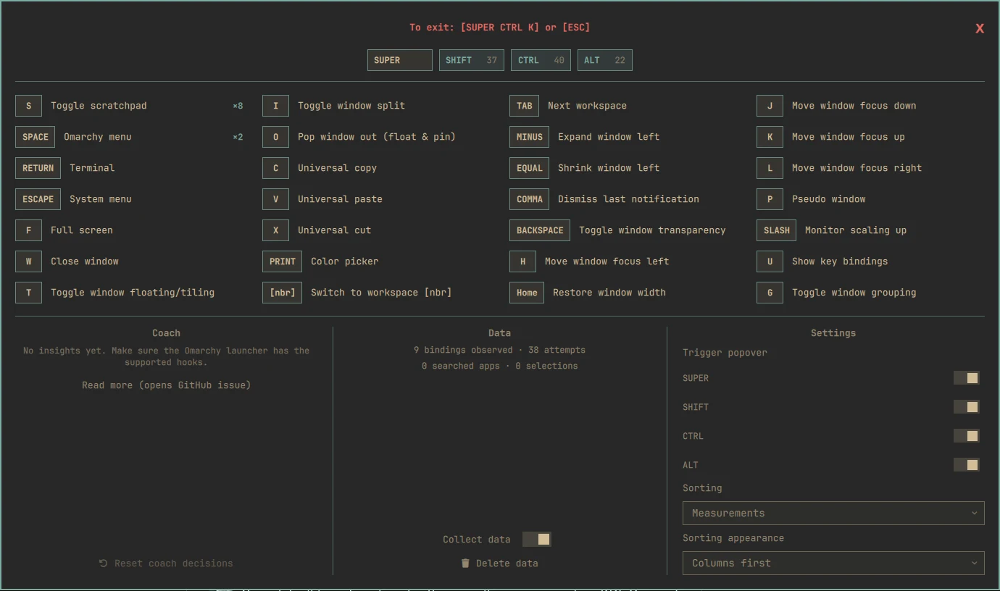

# Omacoach

> ⚠️ **Omarchy search must be modified for searched-app coaching to work.**
> Shortcut discovery and attempted-shortcut measurement work with stock Omarchy,
> but the Coach cannot observe app selections unless the active Omarchy menu has
> the hook in `experiments/menu-search-event.patch` or a compatible future
> upstream event. Omacoach cannot currently detect this support automatically.

Omacoach helps you discover Omarchy with the keyboard and coaches you to become
better at using shortcuts. It is an experimental Omarchy Quattro plugin.

## Screenshots

Hold a configured modifier to open the passive, click-through shortcut overlay:



Press `SUPER+CTRL+K` to open the permanent, interactive panel:



See [GUIDE_PRINTSCREENS.md](GUIDE_PRINTSCREENS.md) to reproduce or update these
images.

## Shortcut overlay

- Reads effective, described bindings from `omarchy-menu-keybindings --print`.
- Shows described keyboard bindings containing at least one supported modifier.
- Opens after a 180 ms hold, avoiding flashes for shortcuts already in muscle
  memory.
- Supports `SUPER`, `SHIFT`, `CTRL`, and `ALT` as independent passive triggers;
  all four are enabled by default and can be disabled separately.
- Filters immediately when modifiers are added or removed.
- Runs as a click-through, keyboard-focus-free layer-shell surface.
- Starts around 50% screen height and grows downward, shifting upward only when
  required to fit the output.
- Collapses numeric workspace and bar-panel families into presentation-only
  `[nbr]` rows while retaining independent underlying bindings and counts.
- Supports source-order, alphabetical, or measurement-count sorting with
  row-first or column-first grid flow.

Mouse, wheel, `XF86`, `code:`, submap, and native multi-key chord bindings are
not promised by this prototype. Hyprland does not expose a post-dispatch event,
so Omacoach records attempted shortcuts rather than confirmed invocations.

## Permanent panel

Press `SUPER+CTRL+K` to toggle the permanent panel. It starts 20% from the top
of the active output and grows downward so the close control and modifier row
stay in fixed positions.

The permanent panel:

- Closes with `Escape`, `SUPER+CTRL+K`, or its top-right close button.
- Uses the same live modifier filtering as the passive overlay.
- Shows Coach, Data, and Settings controls below the shortcut inventory.
- Lets you pause collection, delete local data, configure passive triggers,
  change sorting, and reset coaching decisions.
- Requests keyboard focus only while open; the passive overlay never does.

## Local measurement

Measurement is local and enabled when the plugin is enabled. Omacoach resolves
terminal key presses through the configured XKB keymap and stores aggregate
counts when a chord matches the parsed binding inventory. It stores no raw keys,
unmatched chords, timestamps, focused applications, or event history.

State is stored at:

```text
${XDG_STATE_HOME:-~/.local/state}/omacoach/attempts.json
```

Inspect or control measurement through the permanent panel or IPC:

```bash
omarchy-shell omacoach measurement off
omarchy-shell omacoach measurement on
omarchy-shell omacoach attempts
omarchy-shell omacoach resetAttempts
```

## Searched-app coaching

With the modified menu integration, Omacoach records a stable desktop-entry ID
and display name only when the user explicitly selects an app after a non-empty
search. It does not receive or retain the search query. Inspect the aggregates
with:

```bash
omarchy-shell omacoach searchedApps
```

The matcher cross-checks desktop-entry identity, launcher-capable `o.bind`
definitions, and the effective binding list. It reports URL, command, Omarchy
launcher, and default-application evidence rather than trusting labels alone:

```bash
./scripts/match-searched-app-bindings
./scripts/match-searched-app-bindings --json
```

Coach rows expose three actions:

- **Ignore** hides an app until **Reset coach decisions** is used.
- **Add keybind** prepends a commented, deduplicated app-specific draft to
  `~/.config/hypr/bindings.lua`, then opens the normal Omarchy config editor.
- **Show keybinding** opens the Omarchy keybinding selector narrowed to effective
  launcher bindings matched for that app.

The current shell has no reliable capability probe for this menu integration.
See [UPSTREAM.md](UPSTREAM.md) for the production event and capability contract.
When detection becomes available, only searched-app coaching should be disabled
on unsupported menus; shortcut hints and attempted-shortcut measurement are
independent and should continue working.

## Requirements

- Omarchy Quattro with `omarchy-shell`, `omarchy-menu-keybindings`,
  `omarchy-menu-select`, and `omarchy-launch-config-editor`.
- Hyprland with the Lua APIs validated by `bin/install-hook`.
- `hyprctl`, `luac`, `jq`, `xkbcli`, and Node.js available on `PATH`.
- `qmllint` for development checks only.

Searched-app coaching additionally needs the launcher hook described at the top
of this README. Shortcut discovery and attempted-shortcut measurement work
without it.

## Install

Install and enable the public plugin, then install its Hyprland observer and
`SUPER+CTRL+K` panel binding:

```bash
omarchy plugin add https://github.com/FilipHarald/omacoach.git --enable
~/.config/omarchy/plugins/omacoach/bin/install-hook
```

The hook validates the plugin and Hyprland Lua APIs, makes a timestamped backup
of `~/.config/hypr/bindings.lua`, adds marked observer and panel-binding blocks,
reloads Hyprland, and restores the backup if validation fails.

## Remove

Run the uninstall hook before removing the plugin checkout:

```bash
~/.config/omarchy/plugins/omacoach/bin/uninstall-hook
omarchy plugin remove omacoach
```

Uninstalling disables the plugin when possible, transactionally removes the
observer and panel binding, and permanently deletes
`${XDG_STATE_HOME:-~/.local/state}/omacoach`. Configuration is restored from the
timestamped backup if Hyprland rejects the change.

## Development install

```bash
ln -s "$PWD" ~/.config/omarchy/plugins/omacoach
omarchy-shell shell rescanPlugins
omarchy plugin enable omacoach
./bin/install-hook
```

Use `./bin/uninstall-hook` before removing the development symlink.

## Development

Run all model, observer, lifecycle, plugin, Lua, and QML checks with:

```bash
./scripts/check
```

Preview or hide the passive UI without holding a modifier:

```bash
monitor=$(hyprctl activeworkspace -j | jq -r '.monitor // ""')
omarchy-shell omacoach preview SUPER "$monitor"
omarchy-shell omacoach hide "$(date +%s%3N)"
```

## Attribution

The passive Hyprland observer and contextual overlay architecture were informed
by [NextKey](https://github.com/russellmorton/next-key), Copyright (c) 2026
Russell Morton, available under the MIT License. See
[`THIRD_PARTY_NOTICES.md`](THIRD_PARTY_NOTICES.md).
